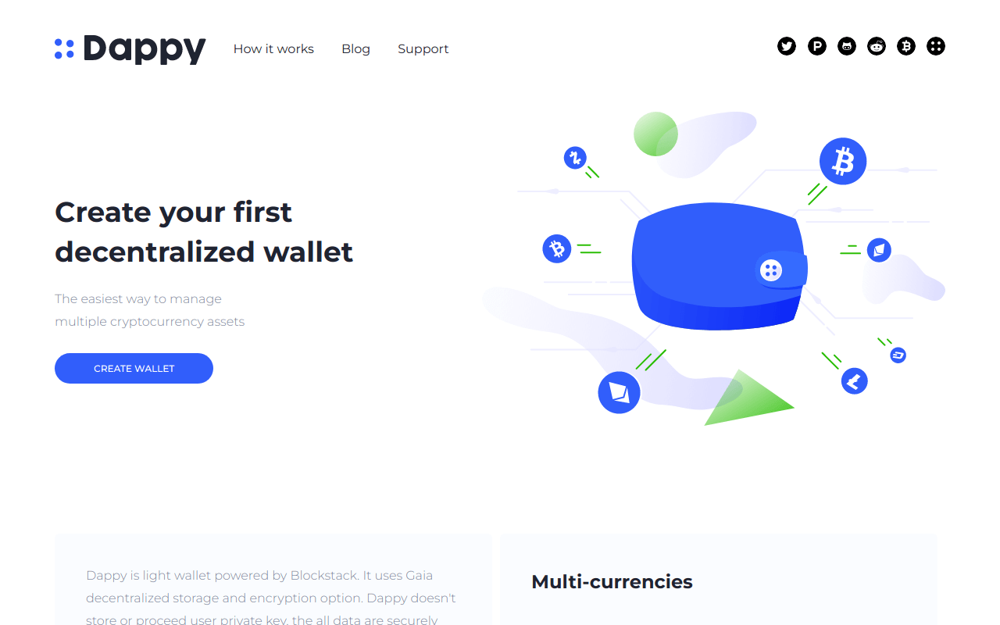

# Dappy landing page

## Built with

  

## About project
My first project that was implemented using HTML and CSS. Initially the project was static. Later, adaptive design was implemented. Further, with the help of jQuery, solutions were found and implemented for opening a mobile menu and calling a modal window. Social media icons made by svg sprite.

### Demo [Dappy](https://dappy-two.vercel.app)
